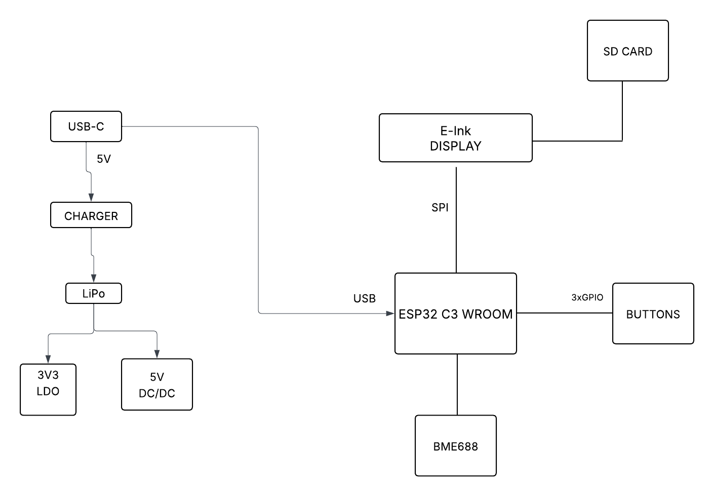

# BOM TSC – Lista de componente

| Nr. piesa | Nume piesa | Site | Datasheet |
| --- | --- | --- | --- |
| 1 | BOOT_BUTON | https://www.snapeda.com/parts/EVQP7L01P/Panasonic%20Electronic%20Components/view-part/?welcome=home | https://www.snapeda.com/parts/EVQP7L01P/Panasonic/datasheet/ |
| 2 | C1, C1_BAT, C1_BAT2, C2,C2_BAT,C3,C4,C4_USB, C5, C5_USB, C6, C7, C8, C9,C10 | https://componentsearchengine.com/part-view/CC0402MRX5R5BB106/YAGEO | https://componentsearchengine.com/Datasheets/2/CC0402MRX5R5BB106.pdf |
| 3 | C10_SUPERCAR | https://industry.panasonic.com/global/en/products/control/switch/light-touch/number/evqpuj02k | https://industry.panasonic.com/global/en/downloads?tab=catalog&small_g_cd=203&part_no=EVQPUJ02K |
| 4 | CHANGE_BUTTON | https://www.snapeda.com/parts/EVQP7L01P/Panasonic%20Electronic%20Components/view-part/?welcome=home | https://www.snapeda.com/parts/EVQP7L01P/Panasonic/datasheet/ |
| 5 | C_DELAY | https://componentsearchengine.com/part-view/CC0402MRX5R5BB106/YAGEO | https://componentsearchengine.com/Datasheets/2/CC0402MRX5R5BB106.pdf |
| 6 | D1 | https://www.snapeda.com/parts/USBLC6-2SC6Y/STMicroelectronics/view-part/?ref=eda | https://www.snapeda.com/parts/USBLC6-2SC6Y/STMicroelectronics/view-part/?ref=eda |
| 7 | EPD_C1,EPD_C2, EPD_C3, EPD_C4, EPD_C5,EPD_C6,EPD_C7,EPD_C8,EPD_C9,EPD_C10,EPD_C11,EPD_C12 | https://componentsearchengine.com/part-view/CC0402MRX5R5BB106/YAGEO | https://componentsearchengine.com/Datasheets/2/CC0402MRX5R5BB106.pdf |
| 8 | IC1 | https://componentsearchengine.com/part-view/BD5229G-TR/ROHM%20Semiconductor | https://datasheet.datasheetarchive.com/originals/distributors/Datasheets_SAMA/f2b9741ef86007909f138d561a359946.pdf |
| 9 | IC4 | https://componentsearchengine.com/part-view/XC6220A331MR-G/Torex | https://product.torexsemi.com/system/files/series/xc6220.pdf |
| 10 | J1 | https://componentsearchengine.com/part-view/FH34SRJ-24S-0.5SH(99)/Hirose | https://www.hirose.com/en/product/document?clcode=CL0580-1255-6-99&productname=FH34SRJ-24S-0.5SH(99)&series=FH34SRJ&documenttype=2DDrawing&lang=en&documentid=0000990903 |
| 11 | J2 | https://componentsearchengine.com/part-view/USB4110-GF-A/GCT%20(GLOBAL%20CONNECTOR%20TECHNOLOGY) | https://gct.co/files/drawings/usb4110.pdf |
| 12 | J3,J4 | https://www.snapeda.com/parts/PRT-14417/SparkFun/view-part/ | https://www.snapeda.com/parts/PRT-14417/SparkFun%20Electronics/datasheet/ |
| 13 | MCP73831 | https://ro.mouser.com/ProductDetail/Microchip-Technology/MCP73831T-2ACI-OT?qs=yUQqVecv4qvbBQBGbHx0Mw%3D%3D&utm_id=20109199409&utm_source=google&utm_medium=cpc&utm_marketing_tactic=emeacorp&gad_source=1&gbraid=0AAAAADn_wf0-USzm1eg1ywGvQg_qMgG3H | https://ro.mouser.com/datasheet/2/268/MCP73831_Family_Data_Sheet_DS20001984H-3441711.pdf |
| 14 | L1 | https://ro.mouser.com/ProductDetail/Wurth-Elektronik/744043680?qs=PGXP4M47uW6VkZq%252BkzjrHA%3D%3D | https://www.we-online.com/components/products/datasheet/744043680.pdf |
| 15 | PFMF.050.1 | https://ro.mouser.com/ProductDetail/EPCOS-TDK/B72520T0350K062?qs=dEfas%2FXlABIszF52uu7vrg%3D%3D | https://www.tdk-electronics.tdk.com/inf/75/db/CTVS_14/Surge_protection_series.pdf |
| 16 | Q1,Q2 | https://componentsearchengine.com/part-view/DMG2305UX-7/Diodes%20Incorporated | https://www.diodes.com//assets/Datasheets/DMG2305UX.pdf |
| 17 | Q3 | https://componentsearchengine.com/part-view/SI1308EDL-T1-GE3/Vishay | https://componentsearchengine.com/part-view/SI1308EDL-T1-GE3/Vishay |
| 18 | Rezistente | https://componentsearchengine.com/part-view/R0402%201%25%20100%20K%20(RC0402FR-07100KL)/YAGEO | https://www.yageo.com/upload/media/product/products/datasheet/rchip/PYu-RC_Group_51_RoHS_L_12.pdf |
| 19 | RESET_BUTTON | https://www.snapeda.com/parts/EVQP7L01P/Panasonic%20Electronic%20Components/view-part/?welcome=home | https://www.snapeda.com/parts/EVQP7L01P/Panasonic/datasheet/ |
| 20 | R_BOOT | https://componentsearchengine.com/part-view/R0402%201%25%20100%20K%20(RC0402FR-07100KL)/YAGEO | https://www.yageo.com/upload/media/product/products/datasheet/rchip/PYu-RC_Group_51_RoHS_L_12.pdf |
| 21 | R_CAPACITOR | https://componentsearchengine.com/part-view/R0402%201%25%20100%20K%20(RC0402FR-07100KL)/YAGEO | https://www.yageo.com/upload/media/product/products/datasheet/rchip/PYu-RC_Group_51_RoHS_L_12.pdf |
| 22 | R_CHANGE | https://componentsearchengine.com/part-view/R0402%201%25%20100%20K%20(RC0402FR-07100KL)/YAGEO | https://www.yageo.com/upload/media/product/products/datasheet/rchip/PYu-RC_Group_51_RoHS_L_12.pdf |
| 23 | R_CL1 | https://componentsearchengine.com/part-view/R0402%201%25%20100%20K%20(RC0402FR-07100KL)/YAGEO | https://www.yageo.com/upload/media/product/products/datasheet/rchip/PYu-RC_Group_51_RoHS_L_12.pdf |
| 24 | R_RESET | https://componentsearchengine.com/part-view/R0402%201%25%20100%20K%20(RC0402FR-07100KL)/YAGEO | https://www.yageo.com/upload/media/product/products/datasheet/rchip/PYu-RC_Group_51_RoHS_L_12.pdf |
| 26 | SENSOR2 | https://www.snapeda.com/parts/BME680/Bosch/view-part/?welcome=home | https://www.snapeda.com/parts/BME680/Bosch%20Sensortec/datasheet/ |
| 27 | SJ1 | https://grabcad.com/library/solder-jumpers-1 | https://grabcad.com/library/solder-jumpers-1 |
| 28 | U1 | https://www.snapeda.com/parts/W25Q512JVEIQ/Winbond+Electronics/view-part/?ref=eda | https://www.snapeda.com/parts/W25Q512JVEIQ/Winbond+Electronics/view-part/?ref=eda |
| 29 | U2 | https://www.snapeda.com/parts/ESP32-C6-WROOM-1-N8/Espressif+Systems/view-part/?ref=eda | https://www.snapeda.com/parts/ESP32-C6-WROOM-1-N8/Espressif%20Systems/datasheet/ |
| 30 | U3 | https://www.snapeda.com/parts/DS3231SN%23/Analog+Devices/view-part/?ref=eda | https://www.snapeda.com/parts/DS3231SN%23/Analog%20Devices/datasheet/ |
| 31 | U4 | https://www.snapeda.com/parts/MAX17048G+T10/Analog+Devices/view-part/?ref=eda | https://www.snapeda.com/parts/MAX17048G+T10/Analog%20Devices/datasheet/ |
| 32 | TP-uri | Le-am desenat manual |  |

---

# README – Descriere Tehnica

README E-BOOK READER
Acest dispozitiv este construit in jurul microcontrollerului ESP32-C6, un modul performant ce integreaza conectivitate WiFi si interfata USB.
Intregul ansamblu a fost proiectat pornind de la schema electrica, rutarea PCB-ului si continuand cu modelarea 3D, unde am pozitionat toate componentele hardware si am proiectat carcasa dispozitivului astfel incat sa permita o asamblare functionala.
Functionalitate hardware
Hardware-ul este compus din mai multe blocuri functionale, fiecare avand rolul. Am integrat atat componente de interfata (buton, ecran), cat si senzori, circuite de alimentare si protectie.
Alimentarea se face printr-un port USB-C, care intra intr-un circuit de protectie ESD. De aici, energia ajunge intr-un circuit integrat de incarcare – MCP73831 – care gestioneaza in mod inteligent incarcarea unei baterii LiPo de 3.7V. Tensiunea de la baterie este apoi stabilizata la 3.3V folosind un regulator LDO, pentru a putea alimenta in siguranta toate componentele electronice de pe placa.
Am ales aceasta arhitectura simpla pentru a minimiza consumul in standby si a maximiza autonomia. In modul deep sleep, majoritatea componentelor intra in consum aproape nul, fiind alimentate doar strictul necesar: senzorul de mediu BME688.
ESP32-C6
ESP32-C6 este nucleul intregului sistem. L-am ales pentru ca ofera o combinatie rara de performanta, conectivitate moderna (WiFi), interfata USB device si suport pentru toate protocoalele de comunicatie de care aveam nevoie: SPI, I2C, GPIO.
ESP-ul se ocupa cu: 
• controlul afisajului e-paper (comunica prin SPI);
• interactiunea cu utilizatorul prin GPIO (butoane);
• comunicarea cu senzorul de mediu BME688 (I2C);
• comunicarea USB pentru debugging sau transmisie de date;
Afisajul e-paper
Pentru afisarea informatiilor, am folosit un ecran e-paper de 7.5 inch, care are avantajul unui consum de energie extrem de redus. E-paper-ul consuma doar in momentul actualizarii imaginii – ceea ce il face ideal pentru un dispozitiv cu autonomie mare.
Display-ul este conectat prin interfata SPI, iar pinii de control precum CS, DC, RST, BUSY sunt conectati la GPIO-uri dedicate ale ESP32. Am mapat acesti pini astfel incat sa fie usor de rutat pe placa si sa nu interfereze cu alte functii critice.
Senzor de mediu BME688
BME688 este un senzor care poate masura temperatura, umiditatea, presiunea. Este conectat la ESP32 prin interfata I2C, comuna cu ceasul de timp real.
Acest senzor are un consum foarte mic, mai ales in modul standby, si este ideal pentru monitorizare ambientala. Este util pentru aplicatii care doresc sa raspunda la conditiile mediului inconjurator.
Interfata utilizator – Butoane
Am integrat 3 butoane tactile, fiecare conectat la un pin GPIO dedicat. Pentru eliminarea fluctuatiilor la apasare, am realizat un debounce hardware folosind filtre RC (rezistor + condensator).
Unul dintre butoane este conectat pe GPIO0, folosit si pentru boot, iar celelalte doua sunt conectate pe GPIO-uri standard.
Detalii despre pini
Fiecare pin a fost ales tinand cont de: 
usurinta de rutare;
 compatibilitatea cu perifericele ESP32-C6;

